# Controlled Regularization and Optimization Study on CIFAR-10

## Abstract

This report presents a controlled experimental study on the effect of regularization and optimization strategies on overfitting, generalization, and robustness in an MLP trained on CIFAR-10. The main contribution of the project is a methodology-first framework in which the core training setup is kept fixed while regularization strategies are varied systematically. After establishing an overfitting baseline, the study compares individual regularization methods, extends the analysis with additional techniques such as data augmentation and adversarial training, and finally evaluates optimizer and scheduler choices on top of a stronger combined configuration. The report focuses not only on performance outcomes, but also on the reasoning behind method selection, experimental design, and interpretation of results.

---

## 1. Introduction

### 1.1 Problem Motivation

Overfitting is a central problem in deep learning because high-capacity models can fit the training data extremely well while failing to generalize to unseen examples. In standard machine learning terms, this corresponds to the gap between optimizing training performance and learning representations that transfer reliably to validation and test data. For that reason, overfitting, underfitting, model capacity, and validation-based model selection are treated as foundational concepts in the deep learning literature rather than as secondary implementation details (Goodfellow, Bengio, & Courville, 2016, Chapter 5).

For the same reason, reporting accuracy alone is not sufficient to evaluate a model meaningfully. High training accuracy may simply indicate memorization, while validation and test performance provide a more reliable indication of generalization. In a regularization-focused study, this requires examining not only accuracy, but also loss curves, generalization gaps, and the relationship between fitting and out-of-sample behavior (Goodfellow, Bengio, & Courville, 2016, Chapters 5 and 7).

These considerations motivate the use of a controlled comparison framework when evaluating regularization methods. If multiple factors change simultaneously, it becomes difficult to determine whether an observed difference comes from the regularization strategy itself or from unrelated choices such as optimizer settings, training duration, or data handling. A controlled setup therefore makes it possible to interpret the effect of regularization more clearly and connect empirical findings to the established literature on generalization and regularization in deep learning.

### 1.2 Project Objective

The primary objective of this project is to investigate how different **regularization strategies** affect **overfitting, generalization, and training stability** in a controlled deep learning setting. More specifically, the project is designed to compare multiple regularization methods on the same MLP architecture trained on CIFAR-10 while keeping the core experimental conditions fixed. This makes it possible to evaluate not only whether a given method improves performance, but also how it changes the relationship between training behavior and out-of-sample generalization. 

A second objective is to move beyond isolated method testing and examine how different regularization mechanisms interact when combined. Since regularization methods operate through different principles—such as parameter constraint, stochastic perturbation, normalization, or training-dynamics control—the project aims to determine whether their effects are complementary or overlapping. For this reason, the study includes both individual methods and combined configurations, allowing the analysis to progress from isolated comparisons to a stronger integrated pipeline. :contentReference[oaicite:2]{index=2}

In addition to the main regularization study, the project includes a secondary **optimization component**. This extension is intended to examine how optimizer choice, learning rate, and scheduler strategy affect convergence and final performance once a stronger regularized setup has been established. In this sense, optimization is treated not as a separate project topic, but as a natural continuation of the regularization study: after identifying a more stable and effective training configuration, the next step is to investigate how that configuration can be trained most effectively. This is also consistent with the course structure, where regularization and optimization are presented as closely related stages of model training rather than disconnected subjects. 

Overall, the project is therefore guided by two complementary questions: **(1) which regularization strategies are most effective under controlled conditions, and why, and (2) how can a stronger regularized configuration be further improved through optimization choices?** By structuring the work in this way, the project aims to satisfy not only a performance-oriented goal, but also the broader methodological goal of explaining why specific approaches were selected and how their effects can be interpreted systematically. 

### 1.3 Scope of the study
- Main focus: regularization ablation study
- Secondary extension: optimization study
  
---

## 2. Methodological Framing

### 2.1 Why a Controlled Study Was Necessary

A controlled study was necessary because the main goal of this project was not simply to report the highest achieved accuracy, but to determine **how and why specific regularization methods change model behavior**. If several experimental factors are modified at the same time, such as the optimizer, model capacity, data split, training duration, or regularization strategy, then any observed performance difference becomes difficult to interpret. In that case, it is no longer clear whether an improvement comes from the regularization method itself or from another unrelated design choice.

For this reason, the project was deliberately organized around a controlled comparison framework in which the core training conditions were kept fixed and only the target method was varied whenever possible. This design made it possible to isolate the effect of each regularization strategy on overfitting, generalization, and training stability, which is far more informative than a loose collection of unrelated experiments. Such a setup is especially important in a project whose purpose is methodological analysis rather than broad benchmark-style experimentation. :contentReference[oaicite:1]{index=1}

More broadly, the controlled setup strengthened the scientific interpretability of the project. By fixing the split, architecture, optimizer, learning rate, batch size, epoch budget, and seed in the main regularization branch, the analysis could focus on the actual mechanism under study. This allowed the project to answer not only whether a method improved results, but also what kind of improvement it produced: reduced generalization gap, improved validation behavior, better robustness, or more stable convergence. In this sense, the controlled study was not only a design preference, but the foundation that made the entire analysis meaningful.

### 2.2 Central Methodological Principle

The central methodological principle of this project was to vary **one main factor at a time whenever possible**, while keeping the rest of the experimental setup fixed. In the regularization branch, this meant preserving the same dataset split, model architecture, optimizer, learning rate, batch size, epoch budget, and random seed structure, and changing only the regularization strategy under investigation. This design choice was essential for turning the project into a true comparative study rather than a set of loosely connected experiments. :contentReference[oaicite:0]{index=0}

This principle was adopted because the purpose of the project was not merely to produce a collection of results, but to build a framework in which the effect of each method could be interpreted clearly. If several design choices are changed simultaneously, then a difference in performance cannot be attributed confidently to the intended method. By contrast, when the training conditions remain fixed, changes in overfitting, validation behavior, and test performance can be interpreted as consequences of the selected regularization mechanism itself. In this sense, controlled variation is what makes the analysis methodologically meaningful. 

This same principle also reflects the broader logic of the course project. The assignment explicitly prioritizes methodological rigor and asks students to explain why a specific approach was chosen over alternatives, rather than presenting broad and superficial experimentation. :contentReference[oaicite:2]{index=2} The regularization project proposal likewise defines the study as a controlled comparison in which the training pipeline is fixed and only the regularization method changes, so that the effects on overfitting, generalization, and training stability can be observed clearly and fairly. :contentReference[oaicite:3]{index=3} Because the course itself introduces regularization and optimization as structured components of deep learning methodology, this one-factor-at-a-time principle provided the most appropriate foundation for the entire project. :contentReference[oaicite:4]{index=4}

At the same time, this principle shaped the overall progression of the project. The work began with an intentionally overfitting baseline, continued with isolated regularization methods, then moved to combined methods, and finally extended into optimizer and scheduler analysis after a stronger regularized configuration had been established. This progression preserved interpretability at each stage: first by isolating individual effects, and later by examining how complementary mechanisms interact in a more integrated pipeline. In that sense, the methodological principle of controlled variation was not limited to a single experiment, but served as the organizing logic of the project as a whole. 

### 2.3 Why This Project Fits the Course Expectations

This project fits the course expectations because it was designed around **methodological depth rather than broad scope**. The assignment explicitly emphasizes that the goal is not to produce a wide but superficial project, but instead to select a focused topic and demonstrate clear application of the concepts covered in class. It also states that students should explain exactly why a particular approach was chosen over alternatives, which makes a controlled and technically interpretable study especially appropriate for this project. :contentReference[oaicite:0]{index=0}

The project aligns closely with the course content itself. The syllabus presents regularization and optimization as core topics in deep learning, including L1/L2 penalties, dropout, early stopping, batch normalization, and optimizer comparisons such as SGD, momentum-based methods, and Adam. :contentReference[oaicite:1]{index=1} Since the present study is built precisely around these topics, it directly reflects the technical material covered in lectures and labs rather than moving into an unrelated problem setting.

It also matches the originally proposed project direction. The project idea document defines the regularization study as a **controlled comparison of regularization methods in MLPs**, with fixed training conditions, multiple regularization families, and evaluation based on overfitting, generalization, and training stability. The same document further suggests that a short optimizer comparison may be added as a bonus extension, provided that the main project remains centered on regularization. :contentReference[oaicite:2]{index=2} The final project structure follows this logic closely: the main body of the work is a regularization ablation study, while the optimization section is positioned as a secondary extension built on top of the stronger regularized setup.

For these reasons, the project is well aligned with the course expectations in both content and structure. It applies the methods studied in class, keeps the focus narrow enough for meaningful analysis, and provides the kind of technical documentation and methodological explanation that the project announcement explicitly asks for. 
---

## 3. Dataset and Experimental Setup

### 3.1 Dataset

The experiments in this project are conducted on **CIFAR-10**, a standard image classification dataset containing ten object categories. In the context of this study, CIFAR-10 was selected as an appropriate benchmark because it provides a sufficiently challenging visual classification problem while remaining manageable for controlled experimentation with an MLP-based pipeline. In other words, it is complex enough to make overfitting visible, yet structured enough to support systematic comparison across multiple regularization and optimization settings. :contentReference[oaicite:0]{index=0}

A reduced but fixed subset of the dataset was used throughout the project in order to make generalization effects more interpretable. The experimental split was defined as **15,000 training samples**, **5,000 validation samples**, and **10,000 test samples**, and this split was reused across experiments to preserve consistency and reproducibility. This choice was especially important because the project was designed as a controlled comparative study: if the data split changed between experiments, then differences in performance could not be attributed confidently to the method under investigation. :contentReference[oaicite:1]{index=1}

The use of CIFAR-10 also fits the methodological goals of the project. Since the main objective was to study how different regularization strategies affect overfitting and generalization under fixed conditions, the dataset needed to be challenging enough for an intentionally overfitting MLP baseline to expose a clear train–validation gap. The selected CIFAR-10 subset served this purpose effectively, providing a stable experimental setting in which baseline overfitting, regularization effects, and later optimization choices could all be analyzed within the same data regime. :contentReference[oaicite:2]{index=2}

### 3.2 Data Split

To ensure a fair and reproducible comparison across experiments, a **fixed train / validation / test split** was used throughout the project. The dataset was partitioned into **15,000 training samples**, **5,000 validation samples**, and **10,000 test samples**, and this split was preserved across the main experimental branches. 

This design choice was methodologically important for two reasons. First, it prevented performance differences from being influenced by repeated resampling or accidental variation in data composition. Second, it allowed all regularization and optimization results to be interpreted under the same data conditions, which is essential in a controlled comparison study. In this way, changes in model behavior could be attributed more confidently to the experimental method rather than to differences in the underlying data partition. 

Within the modular part of the repository, the split was explicitly saved and reused through `splits/fixed_cifar10_split.npz`, further supporting consistency and reproducibility across runs. This also made it possible to separate experiment execution from later analysis and comparison, since all models were evaluated under the same fixed data regime. :contentReference[oaicite:2]{index=2}

### 3.3 Baseline model
- MLP with:
  - input size 3072
  - hidden layers [1024, 512, 256]
  - ReLU activation
  - logits output
- Mention optional modules:
  - dropout
  - batch normalization

### 3.3 Baseline Model

The shared backbone throughout the project was a fully connected **multilayer perceptron (MLP)** designed for CIFAR-10 classification. The model takes flattened image inputs of dimension **3072** and uses three hidden layers with sizes **1024, 512, and 256**, followed by a logits output layer for the ten CIFAR-10 classes. The main activation function used in the hidden layers was **ReLU**. Depending on the experiment, the architecture could additionally include **Dropout** and **Batch Normalization**, but the core backbone remained unchanged across the main comparison setting. :contentReference[oaicite:0]{index=0}

This model choice was deliberate. The project was not designed to maximize benchmark performance through a highly specialized architecture, but to create a controlled setting in which the effects of regularization and optimization could be observed clearly. For that reason, an MLP was a suitable choice: it is simple enough to keep the experimental structure interpretable, yet expressive enough to overfit a reduced CIFAR-10 training subset when regularization is absent. This made it an appropriate backbone for a methodology-focused study centered on overfitting and generalization rather than architectural novelty. 

### 3.4 Why an Overfitting Baseline Was Constructed

A deliberately overfitting baseline was necessary because the main purpose of the project was to study how regularization methods change model behavior under conditions where overfitting is clearly visible. If the baseline model already generalized well without difficulty, then the effect of regularization would be much harder to interpret. By contrast, an overfitting-prone setup creates a strong reference point against which reductions in train–validation and train–test gap can be observed directly. 

In this project, overfitting was encouraged through the combination of a relatively high-capacity MLP, a reduced training subset, and the absence of regularization in the baseline condition. This was not a weakness in the design, but an intentional methodological choice. It allowed the analysis to begin from a clear failure mode and then evaluate how different regularization strategies corrected that behavior. As a result, later improvements in validation performance, test performance, or generalization gap could be interpreted relative to a well-defined initial condition rather than in isolation. 

## 3.5 Fixed Training Conditions

To preserve comparability across the main regularization experiments, the training configuration was kept fixed as much as possible. The shared setup used:

- **Optimizer:** SGD  
- **Learning rate:** 0.01  
- **Batch size:** 128  
- **Maximum number of epochs:** 50  
- **Random seed:** 42  

These settings were reused across the baseline and the core regularization notebooks so that the primary source of variation would be the regularization strategy itself rather than unrelated training choices. In addition, the same evaluation protocol was preserved across the main experiments: models were assessed through the same train, validation, and test split, with the same metric structure and the same general comparison logic. This consistency was important because the project was designed as a controlled study rather than a collection of loosely connected runs.

This fixed setup was methodologically important because it preserved the interpretation of the project as a controlled comparison. If the optimizer, learning rate, training duration, or evaluation procedure had changed from one regularization experiment to another, then the results would have mixed together the effects of multiple design decisions. By keeping these factors constant, the project was able to evaluate each regularization method under the same conditions and therefore support more meaningful comparison.

---

## 3.6 Evaluation Metrics

The evaluation strategy in this project was designed to capture not only raw predictive performance, but also the broader behavior of the training process. For that reason, the experiments tracked combinations of:

- training accuracy,
- validation accuracy,
- test accuracy,
- training loss,
- validation loss,
- test loss,
- and **generalization gap**.

For some experiments, the analysis was extended further to include quantities such as sparsity-related behavior, weight statistics, near-zero weight ratios, and adversarial accuracy when robustness-oriented training was involved. In addition to scalar metrics, the study also used comparative plots and summary tables in order to visualize changes in fitting behavior, convergence, and train–validation divergence across methods. These visual comparisons were especially useful in a methodology-focused report, since they made it easier to interpret not only which method performed better, but also how the training dynamics differed between experiments.

This multi-metric evaluation was necessary because a regularization-focused project cannot be interpreted adequately through a single score. A method may reduce overfitting while lowering training accuracy, improve robustness without maximizing clean accuracy, or produce smaller generalization gaps even when its final score is not the absolute highest. For that reason, the report treats performance as a combination of fitting behavior, generalization quality, robustness, and stability rather than as a one-dimensional accuracy comparison.

---

## 4. Baseline and Overfitting Diagnosis

### 4.1 Baseline Construction

The first step of the project was the construction of a deliberately **unregularized baseline**. This baseline used the shared MLP backbone with hidden dimensions `[1024, 512, 256]` and was trained under the same core conditions later reused in the main regularization branch: **SGD** with learning rate **0.01**, batch size **128**, maximum **50 epochs**, and a fixed seed. No dropout, batch normalization, early stopping, or explicit L1/L2 regularization was applied at this stage. The purpose of this design was to create a clean reference point before introducing any corrective mechanism. 

This baseline was intentionally not designed to be well-regularized. On the contrary, it was meant to expose a clear failure mode. The model capacity was kept relatively high, the training subset was intentionally limited, and the training process was allowed to optimize freely without regularization. This made the baseline suitable for diagnosing overfitting and for measuring how strongly later methods altered the relationship between fitting and generalization. 

### 4.2 Evidence of Overfitting

The saved baseline results show clear evidence of overfitting. In the standalone baseline notebook, the no-regularization model reached **85.81% training accuracy**, while validation and test accuracy remained much lower at **44.50%** and **45.82%**, respectively. This corresponds to a **41.31% train–validation gap** and a **39.99% train–test gap**, which indicates that the model fit the training subset strongly but failed to generalize at the same level to unseen data. :contentReference[oaicite:2]{index=2}

A similar pattern appears in the explicit regularization comparison notebook, where the baseline again achieved approximately **84.87% training accuracy**, compared with **43.84% validation accuracy** and **45.37% test accuracy**, producing a train–validation gap of **41.03%**. The consistency of this pattern across baseline-style runs strengthens the interpretation that overfitting is not incidental in this project setup, but a stable and reproducible property of the chosen baseline configuration. 

These results are important because they show that high training performance alone would have been misleading in this setting. If only training accuracy had been reported, the baseline could have appeared successful. However, the large separation between training and validation/test behavior reveals that the model was learning the training distribution much more effectively than it was learning to generalize. This is precisely the behavior that the regularization study was designed to investigate. 

### 4.3 Why the Baseline Matters

The baseline plays a central role in the logic of the project because all later results are interpreted relative to it. Without a clearly overfitting reference point, it would be much harder to determine whether a given regularization strategy actually improves generalization or simply changes the optimization dynamics in a less meaningful way. The baseline therefore serves as the anchor of the entire experimental design. 

More specifically, the baseline makes it possible to evaluate each later method in terms of multiple dimensions at once: whether it reduces the generalization gap, whether it improves validation and test accuracy, whether it sacrifices training accuracy in exchange for better out-of-sample behavior, and whether it contributes to a more stable overall training process. In that sense, the baseline is not just an initial experiment, but the reference condition that gives the rest of the study methodological coherence. 

---

## 5. Regularization Study

## 5.1 Core regularization methods

## 5.1.1 Dropout

Dropout was included in this study as the primary example of **stochastic regularization**. In the classical formulation introduced by Srivastava et al., dropout works by randomly removing units and their connections during training, thereby reducing excessive co-adaptation between hidden units and helping prevent overfitting. Conceptually, this means that the network cannot rely on a fixed set of supporting activations at every update step; instead, it must learn representations that remain useful under many different partial subnetworks.

Within this project, dropout was implemented as one of the first isolated regularization methods in order to test its effect under a strictly controlled setup. The dropout experiment preserved the same core training conditions used in the other early regularization notebooks: the same CIFAR-10 split, the same MLP backbone with hidden layers `[1024, 512, 256]`, the same optimizer (**SGD**), learning rate (**0.01**), batch size (**128**), maximum epoch count (**50**), and seed (**42**). The main methodological change relative to the baseline was the introduction of dropout itself, with a dropout probability of **0.5**. In this notebook, batch normalization, early stopping, and explicit weight decay were kept disabled so that the effect of dropout could be interpreted in isolation.

The reason for including dropout early in the experimental sequence was that it represents a regularization mechanism fundamentally different from parameter penalties such as L1 or L2. Whereas norm-based penalties act directly on the parameter magnitudes, dropout regularizes the model through **randomness injected into the hidden representation during training**. This made it especially suitable for the project’s ablation logic, which aimed not only to compare performance but also to compare different **mechanisms of regularization** under identical experimental conditions.

From a methodological perspective, the expected role of dropout in this project was not simply to maximize raw training accuracy, but to reduce the gap between training behavior and out-of-sample performance. In other words, dropout was included to test whether a stochastic regularizer could weaken memorization pressure in the overfitting baseline and produce more stable validation and test behavior.

The observed results support this expectation. Compared with the unregularized baseline, dropout substantially reduced the generalization gap while also improving validation and test accuracy. At the same time, training accuracy decreased relative to the baseline, which is consistent with the interpretation that dropout made memorization more difficult. In this sense, dropout behaved as an effective anti-overfitting method: it did not simply improve fitting, but improved the balance between fitting and generalization.

---

## 5.1.2 Early Stopping

Early stopping was included in the study as the main example of **implicit regularization**. Unlike methods such as dropout or L2 penalty, early stopping does not modify the architecture or directly constrain the parameter values. Instead, it limits overfitting by controlling the duration of training. In this sense, it is especially useful in a methodology-focused comparison because it shows that regularization can emerge not only from added penalties or injected noise, but also from decisions about **when training should stop**.

In the project, early stopping was implemented under the same controlled setup used in the other core regularization notebooks. The same CIFAR-10 split, MLP backbone, optimizer, learning rate, batch size, epoch budget, and seed were preserved, while the main methodological change relative to the baseline was the addition of an early stopping rule. In this notebook, dropout, batch normalization, and explicit L1/L2 penalties were kept disabled, and early stopping was configured with **patience = 5** and **min_delta = 1e-4**. This design made it possible to interpret the effect of early stopping independently from other regularization mechanisms.

The inclusion of early stopping was important for two reasons. First, it expanded the comparison beyond structural and penalty-based methods by introducing a regularizer that acts through **training dynamics**. Second, it provided a way to test whether the overfitting baseline could be improved simply by preventing harmful late-stage fitting, without changing the representation space or introducing explicit stochasticity. Methodologically, this made early stopping a strong counterpart to dropout and L2, since it addresses the same problem—poor generalization—but through a fundamentally different mechanism.

The expected effect of early stopping was therefore a reduction in late-stage overfitting, together with smaller train–validation and train–test gaps. The observed results were consistent with this expectation. Early stopping reduced the generalization gap substantially and produced more balanced behavior between training and validation performance, even though it did not maximize training accuracy. This supports the interpretation that a meaningful part of the baseline failure came from over-training, and that controlling training duration alone can function as an effective regularizer in this setup.

---

## 5.1.3 Batch Normalization

Batch normalization was included as an **architectural and optimization-related regularization method**. Although batch normalization is often introduced as a technique for stabilizing optimization, in this project it was also treated as part of the regularization study because it can influence generalization indirectly by changing the internal behavior of the network during training. This made it especially relevant in a comparison where the objective was not only to measure performance, but also to compare different ways in which training can be regularized.

In the batch normalization notebook, the core training setup again remained fixed: the same CIFAR-10 split, the same MLP backbone, and the same optimization configuration were preserved. The intended experimental change relative to the baseline was the activation of **BatchNorm** within the architecture, while dropout, early stopping, and explicit weight decay were kept disabled. This ensured that any change in validation or test behavior could be interpreted as the effect of batch normalization itself rather than as the interaction of multiple methods.

The main motivation for including batch normalization was that it occupies a different conceptual role from dropout, early stopping, or L2 regularization. Whereas dropout injects noise into the hidden representation and L2 constrains parameter magnitude, batch normalization modifies the statistical behavior of intermediate activations and can make training more stable. For that reason, it was an important part of the overall methodology: it allowed the project to compare not just multiple methods, but multiple **families of regularization mechanisms** under the same controlled experimental design.

The expected effect of batch normalization was improved optimization stability and potentially better validation behavior through more stable internal activations. However, the observed results show that batch normalization alone did not provide the same type of anti-overfitting benefit as dropout or early stopping in this setup. It reached extremely high training accuracy while validation and test performance remained relatively weak, producing a very large generalization gap. This suggests that in the present MLP-based CIFAR-10 regime, batch normalization improved optimization more than it improved generalization. Its role therefore became more meaningful when later combined with dropout rather than used as a standalone solution.

---

## 5.1.4 L2 Regularization

L2 regularization was included as the main example of **explicit parameter-space regularization**. In practical training terms, it was implemented through weight decay, but in this project it was also given a stronger theoretical interpretation as **Maximum A Posteriori (MAP) estimation under a Gaussian prior**. This made the L2 experiment especially important because it connected a common implementation choice directly to a statistical learning perspective.

The objective can be written as:

$$
\mathcal{L}_{\text{MAP}} = \mathcal{L}_{\text{CE}} + \lambda \sum_i w_i^2
$$

Under this interpretation, the cross-entropy term corresponds to the negative log-likelihood, while the L2 term corresponds to the negative log-prior under a zero-mean Gaussian assumption. As a result, the total training objective can be interpreted as a MAP estimate rather than as a purely heuristic penalty. This theoretical framing was one of the technically deeper parts of the regularization study and helped distinguish the project from a purely empirical benchmark comparison.

In the dedicated `reg_05_l2_map_gaussian_prior_dropout.ipynb` notebook, L2 regularization was studied together with dropout under the same controlled core setup. Relative to the plain baseline, the methodological changes were the activation of dropout and the addition of explicit L2 regularization through **weight_decay = 1e-4**. In that experiment, dropout remained enabled with **dropout probability = 0.5**, while batch normalization and early stopping were kept disabled. The purpose of this design was to examine whether an explicit parameter constraint and a stochastic hidden-unit regularizer could provide complementary benefits when applied together.

L2 regularization was important in the project for both methodological and conceptual reasons. Methodologically, it represented the clearest explicit penalty-based regularizer in the study. Conceptually, it created a bridge between implementation and theory, allowing the regularization branch to include not only empirical comparisons, but also a mathematically interpretable training objective.

The expected effect of L2 was a more controlled parameter distribution, reduced overfitting pressure, and improved balance between training and out-of-sample behavior. The observed results show that the L2 + Dropout configuration performed strongly and remained competitive with the better core methods, although its gains over dropout alone were relatively modest rather than dramatic. This suggests that explicit parameter control and stochastic regularization can complement one another, but also that their effects may overlap partially depending on the training regime.

---
## 5.2 Combined regularization methods

### 5.2.1 Dropout + BatchNorm

After evaluating individual methods in isolation, the project moved to controlled combination studies in order to examine whether methods with different mechanisms could complement one another. The first such combination was **Dropout + BatchNorm**, which brings together stochastic regularization and architectural normalization. This pairing was methodologically important because it allowed the study to move beyond the question of whether an individual method works and toward the question of whether distinct regularization mechanisms can reinforce one another under the same training setup. :contentReference[oaicite:10]{index=10}

In this notebook, dropout was enabled with **dropout probability = 0.5** and batch normalization was activated in the model, while early stopping and explicit L2 regularization remained disabled. The rest of the experimental setup remained unchanged, preserving the controlled-comparison logic of the project. By keeping the data split, backbone, optimizer, learning rate, batch size, and epoch budget fixed, the experiment isolated the effect of the combination itself rather than introducing multiple unrelated changes. 

The motivation for this combination was that dropout and batch normalization operate through different mechanisms: dropout injects stochastic variation into hidden activations, whereas batch normalization stabilizes activation statistics and training dynamics. If these effects are complementary rather than redundant, then combining them may improve validation behavior and reduce overfitting more effectively than either method alone. For that reason, this notebook marks an important transition in the project from isolated regularization analysis to **interaction analysis between regularization families**. 

---

### 5.2.2 L2 + Dropout

The second controlled combination in the core regularization branch was **L2 + Dropout**, implemented in the notebook that also framed L2 through the MAP / Gaussian prior interpretation. This combination was selected because it joins two conceptually different forms of regularization: an **explicit parameter constraint** and a **stochastic hidden-representation regularizer**. As a result, it provided a natural test of whether regularization methods acting in different spaces could produce complementary effects. 

The configuration preserved dropout with **probability = 0.5** and introduced L2 regularization through **weight_decay = 1e-4**, while batch normalization and early stopping remained disabled. The rest of the training pipeline stayed fixed, maintaining the same controlled setup used throughout the early regularization branch. This was methodologically important because it meant that the effect of the combination could be interpreted directly against the baseline and the single-method notebooks. 

The value of this notebook lies in the fact that it combines theoretical depth with experimental comparison. On the one hand, it tests whether explicit and stochastic regularization work well together empirically. On the other hand, it gives the project a stronger conceptual basis by treating L2 not just as weight decay, but as a MAP objective with a Gaussian prior. For that reason, this combined setup is not only a practical experiment, but also one of the clearest examples in the project of how empirical methodology and theoretical interpretation were integrated. 

## 5.3 Extended Regularization Methods

After the core regularization branch established a controlled comparison among baseline, dropout, early stopping, batch normalization, and combined methods, the study was extended with additional regularization strategies that act through different mechanisms. This extension was important because the project was not limited to classical hidden-layer regularization alone; it also aimed to examine parameter-space regularization in greater detail, input-space regularization through augmentation, and robustness-oriented regularization through adversarial training. In this sense, the extended methods broadened the study while preserving its methodological focus on overfitting, generalization, and interpretability. 

### 5.3.1 L1 vs L2

The comparison between **L1** and **L2** regularization was included to deepen the explicit regularization component of the project. While both methods act directly in parameter space, they do so in different ways: L2 penalizes large weights more smoothly, whereas L1 promotes sparsity by pushing more parameters toward zero. For that reason, this comparison was methodologically valuable not only as a performance study, but also as a structural analysis of how different norm penalties shape the learned model. 

In the dedicated `reg_08_l1_l2_v2.ipynb` notebook, baseline, L1, and L2 were compared under the same main setup, with **SGD**, learning rate **0.01**, maximum **50 epochs**, and seed **42**. The regularization settings used in the notebook were **L1 lambda = 1e-4** and **L2 weight decay = 1e-3**, with an additional stronger L2 follow-up experiment at **5e-3**. This notebook also extended the analysis beyond simple accuracy comparison by tracking weight norms, examining weight distributions, and analyzing sparsity-related behavior. :contentReference[oaicite:3]{index=3}

The main value of this notebook lies in the fact that it shows regularization as a change in **model structure**, not only in final performance. In particular, L1 was used to examine whether improved regularization could be associated with a sparser parameter distribution, while L2 provided a more conservative form of explicit control over parameter magnitude. As a result, the L1 vs L2 study added an important layer of technical depth to the project by linking generalization behavior to weight geometry and parameter statistics. 

### 5.3.2 Data Augmentation

Data augmentation was included as an additional regularization strategy because it acts in a different space from the earlier methods. Rather than modifying the architecture, constraining the parameters, or changing the stopping criterion, augmentation regularizes the model by increasing the diversity of the effective training distribution. This makes it especially relevant in a project centered on overfitting: if a model is prone to memorizing a limited training subset, then training on perturbed but label-preserving variations of the data can reduce that memorization pressure and improve generalization. 

In `reg_09_data_augmentation.ipynb`, augmentation was applied **only to the training set**, while validation and test sets were kept clean. The training pipeline included `RandomHorizontalFlip(p=0.5)`, `RandomCrop(32, padding=4)`, and `ColorJitter(brightness=0.2, contrast=0.2)`. The rest of the experimental setup remained aligned with the broader project logic: the same MLP backbone, **SGD**, learning rate **0.01**, batch size **128**, maximum **50 epochs**, and seed **42**. This made it possible to interpret augmentation as the main source of change rather than mixing it with unrelated architectural or optimization differences. :contentReference[oaicite:6]{index=6}

Methodologically, data augmentation was important because it expanded the project from hidden-layer and parameter-space regularization into **input-space regularization**. It also highlighted an important trade-off: a method may reduce training accuracy while still improving validation behavior and narrowing the generalization gap. In that sense, the augmentation notebook helped reinforce one of the central ideas of the report—namely, that a regularization method should not be judged only by how well it fits the training set, but by how it changes the relationship between fitting and out-of-sample performance. 

### 5.3.3 Adversarial Training

Adversarial training was included as a robustness-oriented extension of the regularization study. Unlike the earlier methods, which primarily target overfitting in the standard generalization sense, adversarial training introduces deliberately perturbed examples during learning and therefore addresses a harder notion of robustness. This made it especially valuable for the project because it allowed the study to ask not only whether a method improves validation and test behavior, but also whether it helps the model remain more reliable under adversarially perturbed inputs. :contentReference[oaicite:8]{index=8}

In `reg_10_adversarial_training.ipynb`, the method was implemented using **FGSM** with perturbation magnitude **epsilon = 0.03**. The notebook used a training objective that combined **50% clean loss** and **50% adversarial loss**, while keeping the same general project backbone and core optimization setting: the MLP architecture, **SGD**, learning rate **0.01**, maximum **50 epochs**, and seed **42**. Evaluation in this notebook explicitly distinguished between **clean test accuracy** and **adversarial test accuracy**, making it possible to assess robustness directly rather than inferring it from standard accuracy alone. :contentReference[oaicite:9]{index=9}

The inclusion of adversarial training was significant for two reasons. First, it broadened the project beyond classical anti-overfitting techniques and introduced a robustness-aware perspective that is still closely connected to generalization. Second, it showed that regularization need not be limited to penalties, normalization, or stopping rules; it can also arise from training on harder examples that challenge the model more directly. For that reason, adversarial training served as a valuable extension of the project’s methodological scope, even if it was not treated as the central topic in the same way as the main regularization branch. 

---

## 6. Full Combined Configuration

### 6.1 Why a Full-Combo Stage Was Necessary

After evaluating individual regularization methods and small controlled combinations, the project moved to a **full combined configuration**. This stage was necessary because isolated experiments are valuable for interpretation, but they do not always reflect how a practically stronger training pipeline should be constructed. A method may show a useful effect on its own, yet its full value may only become apparent when it is combined with other complementary mechanisms. For that reason, the project was designed to move in stages: first isolate the effects of individual regularizers, then examine whether their strengths can be integrated into a more effective overall configuration. 

This transition was also consistent with the methodological structure of the project proposal. The regularization study was originally defined as a controlled comparison of multiple methods, but the expected output was not only a “best method” label; rather, it was a results section showing **which method is most suitable under which condition**. :contentReference[oaicite:1]{index=1} A full-combo stage therefore became important because it allowed the study to move beyond one-factor-at-a-time diagnosis and toward the construction of a stronger integrated training setup informed by the earlier findings.

### 6.2 Components of the Combined Pipeline

The combined configuration assembled several regularization and training-control mechanisms into a single pipeline. In `reg_11_full_combo_before_optimization.ipynb`, the setup included:

- **Dropout** with `dropout_p = 0.2`
- **Batch Normalization**
- **L1 regularization** with `l1_lambda = 5e-7`
- **L2 regularization** with `weight_decay = 1e-4`
- **Data augmentation**
- **Adversarial training**
  - `adv_ratio = 0.15`
  - `epsilon = 0.03`
- **Early stopping**
  - `patience = 10`
  - `min_delta = 0.001`
- **AdamW**
- **CosineAnnealingLR**
- learning rate `1e-3` :contentReference[oaicite:2]{index=2}

The augmentation pipeline in this notebook also differed slightly from the standalone augmentation notebook, using:

- `RandomHorizontalFlip()`
- `RandomCrop(32, padding=4)`
- `ColorJitter(brightness=0.1, contrast=0.1, saturation=0.1)` :contentReference[oaicite:3]{index=3}

An important methodological detail is that adversarial training in the full-combo setup was lighter than in the standalone FGSM notebook. Instead of using a strict 50% clean and 50% adversarial loss at every step, adversarial batches were injected probabilistically through `adv_ratio = 0.15`. This made the combined pipeline more balanced and better suited for integration with several other regularization mechanisms. :contentReference[oaicite:4]{index=4}

### 6.3 Why These Methods Were Combined

The combined configuration was not built by simply stacking methods arbitrarily. The selection followed a **complementarity logic**, where each component addressed a different aspect of the overfitting and generalization problem.

- **L1 and L2** acted in **parameter space**, encouraging smaller or sparser weights.
- **Dropout** acted as a **stochastic hidden-layer regularizer**, reducing co-adaptation.
- **Batch Normalization** acted through **activation stabilization and training dynamics**.
- **Data augmentation** acted in **input space**, increasing the diversity of the effective training distribution.
- **Adversarial training** acted through **hard-example exposure and robustness pressure**.
- **Early stopping** acted through **training-duration control**, preventing harmful late-stage fitting. 

Because these methods do not all operate through the same mechanism, combining them created a stronger test of whether improvements from different regularization families could accumulate rather than cancel out. This was one of the most important methodological transitions in the project: it shifted the analysis from asking **which single method helps most** to asking **how a principled combination of methods can produce a stronger and more balanced training regime**. 

### 6.4 Interpretation of the Full-Combo Stage

The full-combo stage was one of the strongest points of the project because it demonstrated that the study was not limited to isolated diagnosis. Instead, it showed how insights from the earlier ablation-style experiments could be used to construct a more effective final pipeline. According to the saved results, the combined configuration achieved **58.73% training accuracy**, **54.92% validation accuracy**, **55.78% test accuracy**, and **43.83% adversarial test accuracy**, with a **3.81% train–validation gap** and a **2.95% train–test gap**. These numbers indicate not only stronger validation and test behavior than the plain baseline, but also substantially improved balance between training and generalization. :contentReference[oaicite:7]{index=7}

From a methodological standpoint, this stage supports one of the central conclusions of the report: **no single regularization method solves the generalization problem completely, but complementary methods can work together to produce a much stronger overall configuration**. The full-combo notebook therefore serves as the bridge between the regularization study and the final optimization study, because it establishes a realistic high-quality training regime on top of which optimizer and scheduler analysis becomes meaningful. 

---

## 7. Optimization Study

### 7.1 Why Optimization Was Added

The optimization study was included as a secondary extension of the project after the regularization component had already been established. This addition was consistent with the original project design, which proposed optimizer comparison as a **bonus extension** that could be added without overshadowing the main regularization topic. :contentReference[oaicite:9]{index=9} In that sense, optimization was not treated as a separate or competing project theme, but as the next logical stage after the regularization analysis.

This extension also fits the structure of the course itself. The syllabus presents **regularization** and **optimization for training deep models** as adjacent core topics, covering SGD, momentum, Adam, and learning-rate scheduling after the regularization unit. :contentReference[oaicite:10]{index=10} Since the regularization study had already produced a stronger integrated setup, it became methodologically meaningful to ask how that setup should be optimized most effectively.

### 7.2 Why Optimization Was Performed on the Stronger Setup

A key design decision in this project was that optimization was not studied on top of the weak unregularized baseline. Instead, it was evaluated after a stronger full-combo regularized configuration had been established. This choice was important because tuning optimizers on a clearly overfitting and unstable baseline would have produced results that were less representative of a realistic final pipeline. By contrast, optimizing a stronger regularized model allowed the study to focus on how optimizer and scheduler choices affect convergence and final performance once the basic generalization problem has already been addressed. 

This design also preserved the overall logic of the project. The study first asked how regularization methods change model behavior under controlled conditions. Only after that question had been explored did it move to the question of how a strong regularized setup should be trained most effectively. This sequencing kept the optimization section subordinate to, and informed by, the regularization results rather than turning the report into two disconnected mini-projects. 

### 7.3 Optimizers Compared

The final optimization notebook compared three optimizers:

- **SGD**
- **SGD + Momentum**
- **AdamW** :contentReference[oaicite:13]{index=13}

These choices were natural in the context of both the course material and the project proposal. The course covers SGD, momentum-based methods, adaptive optimizers such as Adam, and learning-rate scheduling as core optimization topics. :contentReference[oaicite:14]{index=14} The proposal document also explicitly suggested that a short optimizer comparison between **SGD**, **SGD + Momentum**, and **Adam** could be added as a bonus extension. :contentReference[oaicite:15]{index=15}

Within the project, the optimizer comparison was designed as a **fast selection stage** performed on top of the stronger full-combo configuration. The reported results show that **AdamW** achieved the strongest validation and test behavior among the tested candidates, outperforming both plain SGD and SGD with momentum in that setting. This justified carrying AdamW forward into the later learning-rate and scheduler comparison stages. :contentReference[oaicite:16]{index=16}

### 7.4 Learning-Rate Comparison

After selecting the best optimizer family, the next step was to test learning-rate sensitivity. This stage was important because optimizer choice alone is not sufficient: a good optimizer can still perform poorly if its learning rate is badly chosen. In the final optimization notebook, learning-rate comparison was performed for **AdamW**, with candidate values:

- `1e-2`
- `1e-3`
- `1e-4` :contentReference[oaicite:17]{index=17}

The reported results showed that **0.001** was the most suitable choice under the selected full-combo regime, offering the best balance among the tested options. This stage was methodologically useful because it ensured that the final optimizer comparison did not stop at a coarse label such as “AdamW is best,” but instead refined that choice into a more practically valid training configuration. :contentReference[oaicite:18]{index=18}

### 7.5 Scheduler Comparison

The final stage of the optimization analysis was the scheduler comparison. Once the optimizer and learning rate had been selected, the study compared four scheduler settings:

- **None**
- **StepLR**
- **CosineAnnealingLR**
- **ReduceLROnPlateau** :contentReference[oaicite:19]{index=19}

This stage was necessary because learning-rate schedules can substantially affect both convergence behavior and final performance, especially in later training stages. By including a scheduler comparison, the project extended the optimization study beyond a simple optimizer benchmark and turned it into a more complete investigation of training dynamics. According to the saved results, **StepLR** was selected by validation performance in the final optimization notebook, while **CosineAnnealingLR** also showed strong behavior and had already been used successfully in the full-combo stage. :contentReference[oaicite:20]{index=20}

### 7.6 Interpretation of the Optimization Study

The optimization study showed that even after a strong regularized configuration has been established, training choices still matter substantially. The final tuned run, based on **AdamW**, learning rate **0.001**, and **StepLR**, achieved **60.89% training accuracy**, **54.00% validation accuracy**, **54.87% test accuracy**, and **43.35% adversarial accuracy**. These results confirm that optimization remained an important factor in shaping the final performance of the project, even though it was introduced only after the main regularization analysis had been completed. :contentReference[oaicite:21]{index=21}

More importantly, the optimization study strengthened the overall methodological structure of the project. It showed that the work did not stop at identifying useful regularization methods; it also addressed how a stronger integrated configuration should be trained in a more refined way. For that reason, the optimization section functions best as the final stage of the project’s argument: after building a strong regularized pipeline, the remaining question becomes how to optimize it most effectively. 
---

## 8. Results

This section presents the empirical findings of the project in the same staged order in which the experiments were designed. Since the repository contains multiple experimental branches, the results are organized according to the methodological progression of the study: first the controlled regularization branch, then the extended regularization experiments, followed by the full combined configuration, and finally the optimization study. In each subsection, the numerical results are followed by interpretation so that the findings are discussed not only in terms of performance values, but also in terms of what they imply about overfitting, generalization, robustness, and training behavior.

### 8.1 Core Regularization Branch Results

The first set of results comes from the controlled regularization branch, in which the same MLP backbone and core training setup were preserved while only the regularization strategy was changed. This branch includes the baseline, dropout, early stopping, batch normalization, dropout + batch normalization, and L2 + dropout.

| Experiment | Final Train Acc | Final Val Acc | Final Test Acc | Gap (Train-Val) | Gap (Train-Test) |
|---|---:|---:|---:|---:|---:|
| Baseline | 87.38% | 45.46% | 46.60% | 41.92% | 40.78% |
| Dropout | 62.55% | 47.86% | 49.13% | 14.69% | 13.42% |
| EarlyStopping | 60.13% | 47.42% | 47.68% | 12.71% | 12.45% |
| BatchNorm | 96.79% | 43.46% | 43.49% | 53.33% | 53.30% |
| Dropout + BatchNorm | 70.05% | 49.66% | 50.30% | 20.39% | 19.75% |
| L2 (MAP Gaussian Prior) + Dropout | 62.87% | 47.94% | 49.13% | 14.93% | 13.74% |

These results show that the regularization methods do not improve performance in the same way. The baseline exhibits severe overfitting, with very high training accuracy but substantially weaker validation and test performance. This confirms that the initial setup was indeed appropriate for a regularization study.

Among the single-method experiments, **dropout** and **early stopping** both reduce the generalization gap substantially. Dropout improves validation and test performance while also lowering overfitting pressure, whereas early stopping produces one of the smallest gaps in the core branch, indicating that controlling training duration alone can already act as an effective regularizer.

**Batch normalization** behaves differently from the other methods. Although it reaches extremely high training accuracy, its validation and test performance remain weak, producing the largest generalization gap in the branch. In this experimental setting, batch normalization by itself appears to improve optimization more than it improves generalization.

The strongest performance in the core branch is achieved by **Dropout + BatchNorm**, which gives the highest validation and test accuracy among the branch methods. This suggests that stochastic regularization and architectural normalization become more useful when combined than when batch normalization is applied alone. **L2 + Dropout** also performs strongly and shows that explicit parameter control can complement stochastic regularization, although in this branch its improvement over dropout alone is modest rather than dramatic.

Overall, the core branch demonstrates that different regularization methods address overfitting through different mechanisms, and that the strongest behavior emerges from carefully selected combinations rather than from a single universally dominant method.

---

### 8.2 Standalone Baseline Reconfirmation

A separate baseline notebook was also used to confirm the overfitting behavior outside the branch summary pipeline.

| Setup | Train Acc | Val Acc | Test Acc | Train-Val Gap | Train-Test Gap |
|---|---:|---:|---:|---:|---:|
| Baseline (No Regularization) | 85.81% | 44.50% | 45.82% | 41.31% | 39.99% |

This result is consistent with the core branch baseline and reinforces the same conclusion: the unregularized MLP fits the training subset strongly but generalizes poorly. The consistency across baseline-style runs is important because it shows that the overfitting behavior is not accidental or tied to a single notebook output, but is a stable property of the chosen setup.

---

### 8.3 Explicit Regularization Extension: L1 vs L2

The explicit regularization extension focuses on the direct comparison between baseline, L1, and L2. Unlike the earlier branch-level comparison, this notebook also examines weight behavior and sparsity.

| Model | Train Acc | Val Acc | Test Acc | Train-Val Gap |
|---|---:|---:|---:|---:|
| Baseline (No Regularization) | 84.87% | 43.84% | 45.37% | 41.03% |
| L1 Regularization | 65.58% | 40.46% | 41.40% | 25.12% |
| L2 Regularization (SGD) | 80.43% | 43.36% | 44.67% | 37.07% |

Additional sparsity-related statistics were also reported:

- Baseline: **50.5%** of weights satisfy `|w| < 0.01`
- L1: **78.2%**
- L2: **53.5%**

This comparison reveals a clear trade-off between structural regularization and predictive performance. **L1** reduces the generalization gap much more strongly than the baseline and induces substantially more sparsity, but it also lowers train, validation, and test accuracy. **L2**, by contrast, is more conservative: it preserves performance more effectively, but does not produce the same level of sparsity.

These findings are important because they show that explicit regularization cannot be judged only by final accuracy. L1 and L2 serve different purposes. L1 is more aggressive and structurally meaningful when sparsity is important, whereas L2 provides milder regularization that stabilizes the model without changing the parameter distribution as strongly.

---

### 8.4 Data Augmentation Results

The augmentation experiment extends the analysis into input-space regularization.

| Model | Train Acc | Val Acc | Test Acc | Train-Val Gap |
|---|---:|---:|---:|---:|
| Data Augmentation | 47.75% | 44.68% | 46.02% | 3.07% |

This is one of the most striking gap-reduction results in the project. Training accuracy becomes much lower than in the plain baseline, but the validation and test behavior remain competitive while the generalization gap shrinks dramatically.

This result is methodologically important because it reinforces a central point of the report: a good regularization method should not be judged only by how well it fits the training set. In this case, augmentation makes training harder, but this difficulty is precisely what prevents the model from over-specializing to the limited training subset.

---

### 8.5 Adversarial Training Results

The adversarial training notebook broadens the study from standard generalization to robustness-aware generalization.

| Model | Train Acc | Val Acc | Clean Test Acc | Adversarial Test Acc | Train-Val Gap | Robustness Drop |
|---|---:|---:|---:|---:|---:|---:|
| FGSM Adversarial Training | 70.95% | 46.00% | 48.05% | 31.19% | 24.95% | 16.86% |

These results show that adversarial training improves robustness awareness, but it does not by itself produce the strongest overall generalization profile in the project. The model performs better under perturbed inputs than a standard clean-only regime would be expected to, yet the gap between clean and adversarial performance remains substantial.

This suggests that adversarial training is valuable, but should be viewed as a complementary mechanism rather than a complete standalone solution. Its main contribution in this project is that it introduces a harder and more demanding notion of model reliability, which later becomes more effective when incorporated into the full combined setup.

---

### 8.6 Full Combined Configuration Results

The strongest integrated regularization setup was obtained in the full-combo notebook.

| Setup | Train Acc | Val Acc | Test Acc | Adversarial Test Acc | Train-Val Gap | Train-Test Gap |
|---|---:|---:|---:|---:|---:|---:|
| Full Combo + AdamW + CosineAnnealingLR | 58.73% | 54.92% | 55.78% | 43.83% | 3.81% | 2.95% |

This is one of the most important findings in the project. Compared with the plain baseline, the full-combo setup improves validation and test accuracy substantially while reducing the generalization gap to a very small level. At the same time, adversarial accuracy is much stronger than in the standalone FGSM notebook.

This result supports the main methodological conclusion of the study: the strongest overall behavior does not come from a single regularization trick, but from a principled combination of complementary mechanisms. The full-combo stage therefore acts as both an empirical result and a methodological argument for integrated regularization design.

---

### 8.7 Optimization Results

The final optimization study examines how the stronger regularized pipeline should be trained most effectively.

#### Fast optimizer comparison

| Optimizer | LR | Train Acc | Val Acc | Test Acc |
|---|---:|---:|---:|---:|
| SGD | 0.01 | 45.79% | 42.94% | 44.35% |
| SGD + Momentum | 0.01 | 46.41% | 43.02% | 44.86% |
| AdamW | 0.001 | 48.42% | 45.78% | 47.16% |

The optimizer comparison shows that optimization remains important even after a strong regularized configuration has already been established. Among the tested candidates, **AdamW** provides the strongest validation and test behavior, which justifies taking it forward into the later tuning stages.

#### Fast learning-rate comparison for AdamW

| Optimizer | LR | Train Acc | Val Acc | Test Acc | Adv Acc |
|---|---:|---:|---:|---:|---:|
| AdamW | 0.01 | 47.39% | 44.12% | 45.27% | 37.84% |
| AdamW | 0.001 | 48.15% | 45.88% | 46.25% | 37.76% |
| AdamW | 0.0001 | 48.05% | 45.44% | 46.71% | 36.04% |

The learning-rate comparison shows that even with the same optimizer, performance changes meaningfully as the step size changes. The selected value of **0.001** therefore should not be treated as a minor tuning detail, but as a meaningful part of the final training configuration.

#### Fast scheduler comparison

| Scheduler | Train Acc | Val Acc | Test Acc | Adv Acc |
|---|---:|---:|---:|---:|
| None | 47.82% | 44.76% | 46.24% | 37.51% |
| StepLR | 50.48% | 47.08% | 47.76% | 39.06% |
| CosineAnnealingLR | 50.71% | 46.90% | 49.12% | 39.78% |
| ReduceLROnPlateau | 49.74% | 46.30% | 47.97% | 39.68% |

The scheduler results show that convergence behavior still changes meaningfully once optimizer and learning rate have already been selected. In this notebook, **StepLR** was chosen by validation performance, although **CosineAnnealingLR** also showed strong behavior, especially in terms of test and adversarial accuracy.

#### Final tuned result

| Final Setup | Train Acc | Val Acc | Test Acc | Adversarial Acc | Train-Val Gap | Train-Test Gap |
|---|---:|---:|---:|---:|---:|---:|
| AdamW + `lr=0.001` + StepLR on full combo | 60.89% | 54.00% | 54.87% | 43.35% | 6.89% | 6.02% |

The final tuned run confirms that optimization continues to shape the final outcome even after strong regularization has been established. Although the gains at this stage are more incremental than in the shift from baseline to regularized training, they remain important because they determine how effectively the stronger integrated pipeline is ultimately trained.

Overall, the optimization study strengthens the report by showing that a good final model does not emerge only from choosing the right regularizers, but also from pairing that regularized configuration with an appropriate optimizer, learning rate, and scheduling strategy.

---

## 9. Discussion

This section interprets the empirical results of the project from a methodological perspective. Rather than treating the reported numbers as isolated outcomes, the discussion focuses on what they reveal about **overfitting control, generalization, robustness, sparsity, training stability, and method interaction**. Since the project was designed as a controlled comparative study, the main goal of this section is not simply to identify the numerically strongest method, but to explain **why certain methods behaved as they did**, **what kind of benefit each method provided**, and **why the final project structure was organized in this specific way**. This is especially important because the project was explicitly designed to prioritize methodological rigor, technical depth, and justification of approach selection rather than broad but shallow experimentation. 

### 9.1 Which Methods Helped Most, and in What Sense?

The results show that different methods were successful in **different senses**, which is one of the main reasons why a single “best method” label would be too simplistic for this project.

#### Best generalization

If generalization is interpreted in terms of **small train–validation and train–test gaps together with strong validation/test performance**, the strongest result came from the **full combined configuration**. It achieved the most balanced behavior across training, validation, and test sets while also maintaining strong adversarial accuracy. This suggests that the best generalization in this project did not come from any single regularizer in isolation, but from a principled integration of complementary regularization mechanisms.

Among the more isolated experiments, **Dropout + BatchNorm** was the strongest configuration in the core controlled regularization branch. It achieved the best validation and test accuracy within that branch, indicating that a stochastic regularizer and a normalization-based mechanism can complement each other effectively when used together. In contrast, the plain baseline strongly overfit, confirming that the original setup was appropriate for observing generalization failures clearly.

#### Best robustness

If robustness is interpreted in terms of **adversarial test accuracy**, the strongest result again came from the **full combined setup**, not from the standalone adversarial training notebook. This is an important finding. It suggests that robustness-oriented training becomes much more effective when it is placed inside a broader regularized pipeline rather than used in isolation. The standalone FGSM experiment did improve robustness awareness, but its adversarial accuracy remained clearly lower than that of the later integrated configuration.

This means that in this project, robustness was not best improved by adversarial training alone, but by adversarial training combined with other mechanisms that also stabilized the representation and reduced overfitting more broadly.

#### Best stability

If stability is interpreted in terms of **controlled fitting behavior and reduced generalization gap**, **early stopping** and **data augmentation** stand out. Early stopping produced one of the smallest train–validation gaps in the core regularization branch, which shows that simply controlling training duration can already regularize the model effectively. Data augmentation also produced a remarkably small gap, indicating that the model became much less prone to memorization when the effective training distribution was enriched.

These methods are especially important because they demonstrate that stability does not require high training accuracy. In fact, some of the most stable behaviors in the project were observed precisely in configurations where training accuracy was lower, but validation and test behavior became more reliable.

#### Best sparsity behavior

For sparsity, **L1 regularization** was clearly the strongest method. It produced the highest proportion of near-zero weights and therefore had the most pronounced structural effect on the parameter distribution. This confirms the expected role of L1 as a sparsity-inducing penalty. However, that structural advantage came with reduced predictive performance compared with the stronger validation/test configurations in the project. For that reason, L1 was the best method for sparsity, but not for overall integrated generalization performance.

#### Best final integrated performance

The strongest final integrated performance came from the **full-combo stage**, followed by the **optimized full-combo configuration**. This is perhaps the most important overall result of the report. The project shows that the highest-quality final model emerged not from a single isolated technique, but from a combination of explicit regularization, stochastic regularization, input-space regularization, robustness-oriented training, training-duration control, and careful optimizer/scheduler selection.

This result is methodologically meaningful because it validates the overall progression of the project: begin with isolated analysis for interpretability, then move toward integration for stronger final performance.

---

### 9.2 Why Some Methods Helped More Than Others

The results cannot be explained adequately by comparing scores alone; they need to be understood in terms of **mechanism**.

**Dropout** helped because it acts as a stochastic regularizer. By randomly deactivating units during training, it prevents the network from relying too heavily on fixed hidden-unit interactions. In an overfitting-prone setup, this makes memorization more difficult and encourages more distributed representations. This explains why dropout improved validation and test behavior while lowering training accuracy relative to the baseline.

**Early stopping** helped because it regularizes through **training dynamics** rather than parameter penalties or noise injection. In this project, the baseline MLP had enough capacity to keep improving on the training set long after generalization had stopped improving. Early stopping interrupted that late-stage fitting and therefore reduced overfitting without changing the architecture itself. Its strong performance in gap reduction reflects the fact that part of the baseline’s failure came from over-training rather than from architecture alone.

**Batch normalization** was more complex. In principle, batch normalization stabilizes intermediate activations and can improve optimization. However, in this project, batch normalization alone did not improve generalization effectively. Its very high training accuracy together with weak validation and test behavior suggests that improved optimization is not automatically the same as improved regularization. That is precisely why the method became more useful when paired with dropout: the normalization effect alone was not enough to control the model’s capacity, but it became beneficial when combined with stochastic regularization.

**L2 regularization** helped by constraining parameter magnitude. Its effect was milder than L1 and also milder than some of the stronger branch combinations, which is consistent with the idea that L2 stabilizes the model without fundamentally restructuring the learned parameter distribution. In this project, L2 was useful, but not transformative on its own.

**L1 regularization** had a stronger structural effect because it pushed more parameters toward zero. This explains its high sparsity ratio. However, that same aggressiveness also reduced predictive performance. In other words, L1 changed the model more fundamentally than L2, which made it effective for sparsity but less effective as the strongest general-purpose regularizer.

**Data augmentation** helped because it regularized the model in **input space** rather than parameter space. By making the effective training distribution harder and more diverse, it reduced memorization pressure without changing the architecture. This is why it produced such a small generalization gap despite much lower training accuracy.

**Adversarial training** helped in yet another way: it trained the model on deliberately harder examples, increasing robustness pressure. However, by itself it did not solve the whole generalization problem. That makes sense mechanistically: adversarial training targets a more demanding notion of local stability, but it does not automatically replace the broader anti-overfitting effects provided by dropout, augmentation, or early stopping.

The **full-combo configuration** helped most because it combined methods that act in **different spaces**: parameter space, hidden representation space, input space, robustness space, and training-dynamics space. This is why the integrated configuration was stronger than any isolated method. It did not depend on one mechanism doing everything; instead, it distributed the regularization burden across several complementary mechanisms.

---

### 9.3 Trade-Offs

A key conclusion of the project is that every major method introduces a trade-off. This is one reason why the final report should not frame the results as a simple ranking problem.

#### L1: sparsity vs accuracy

L1 regularization produced the strongest sparsity behavior in the project, which makes it highly interpretable from a structural standpoint. However, this came with reduced training, validation, and test accuracy. The trade-off here is therefore clear: **L1 is strong when sparsity is desirable, but weaker when the goal is best overall predictive performance**.

#### Data augmentation: lower training accuracy vs smaller gap

Data augmentation sharply reduced the generalization gap, but it did so by making the training task harder. As a result, training accuracy dropped substantially compared with the baseline. This is a meaningful trade-off because it shows that a method may look weaker if judged only by how well it fits the training set, while actually being much stronger if judged by generalization quality. In this project, augmentation is one of the clearest examples of why training accuracy alone is not an adequate evaluation criterion.

#### Adversarial training: robustness vs optimization difficulty

Adversarial training adds a more difficult objective, since the model must learn not only from clean inputs but also from perturbed inputs. This helps robustness, but it also makes optimization harder and does not necessarily maximize clean accuracy. In this project, adversarial training improved robustness awareness, but the clean-to-adversarial gap remained significant in the standalone setting. The trade-off here is therefore between **greater robustness** and **a more difficult optimization problem**.

#### Combination: complexity vs performance

The full-combo setup produced the strongest overall behavior, but it also introduced the greatest complexity. Once multiple methods are combined, it becomes harder to attribute gains to a single factor and harder to manage the training pipeline. The trade-off is therefore between **interpretability and simplicity** on the one hand, and **final integrated performance** on the other.

This is why the project needed both stages: the isolated experiments for interpretability, and the full-combo stage for final performance.

---

### 9.4 Why the Chosen Approach Was Preferred

This subsection is especially important because the instructor explicitly expects the project to explain **why a specific approach was chosen over alternatives**. :contentReference[oaicite:1]{index=1}

#### Why an MLP instead of moving directly to a CNN?

A CNN would likely have produced stronger raw CIFAR-10 performance, but that was not the main goal of the project. The purpose of the study was not to build the most competitive image classifier, but to create a setting in which the effects of regularization and optimization could be observed clearly. An MLP was preferable for this purpose because it is simple enough to keep the methodology interpretable, yet expressive enough to overfit a reduced CIFAR-10 subset strongly. This made it a better choice for a controlled regularization study than a more specialized and powerful architecture.

#### Why controlled ablation instead of broad benchmark-style experimentation?

A broad benchmark-style project might have allowed more architectures, more datasets, or more hyperparameter search, but it would have weakened interpretability. Since the assignment explicitly prioritizes methodological rigor and asks students to justify their selected approach, a controlled ablation framework was the more appropriate design choice.  By keeping the main experimental conditions fixed, the project could answer a much stronger scientific question: **what changes when the regularization method changes, and why?**

#### Why was regularization kept as the main topic?

Regularization remained the main topic because it was the most coherent way to connect the project to the course emphasis on overfitting, generalization, dropout, L1/L2, early stopping, and batch normalization.  It also matched the original project proposal, which defined the work as a controlled regularization comparison and only suggested optimizer comparison as a secondary extension. :contentReference[oaicite:4]{index=4} Keeping regularization as the main axis therefore preserved both the methodological focus and the course alignment of the project.

#### Why was optimization added as a secondary extension?

Optimization was added because once a stronger regularized setup had been established, it became natural to ask how that setup should be trained most effectively. This made optimization a meaningful extension rather than a separate topic. It also matched the course structure, where optimization is taught directly after regularization, and the project proposal, which suggested optimizer comparison as an additional bonus component rather than the central study. 

#### Why were certain combinations taken forward and others not?

The combinations that were taken forward were the ones that showed either conceptual complementarity or empirical promise. For example, Dropout + BatchNorm was meaningful because it combined stochastic regularization with architectural normalization. L2 + Dropout was meaningful because it combined explicit parameter control with stochastic hidden-layer regularization. The full-combo stage then extended this logic further by integrating methods that regularize different aspects of the model and training process.

Not every possible combination was tested exhaustively because that would have shifted the project away from controlled methodology and toward a much broader search problem. The combinations that were chosen were selected because they were both theoretically meaningful and consistent with the staged progression of the project.

---

### 9.5 Connection to Course Methodology

This project is closely aligned with the methodological structure of the course because it translates the main concepts covered in class into a single, coherent experimental framework. Rather than addressing overfitting, regularization, and optimization as separate topics, the study brings them together around one central question: **how can overfitting be diagnosed, interpreted, and reduced under controlled training conditions?** In this sense, the project does not merely use course topics as background references; it operationalizes them through a structured empirical design. 

The first point of alignment is the treatment of **overfitting as the central problem**. The project begins with an intentionally overfitting baseline and evaluates model behavior through training, validation, and test performance rather than relying on training accuracy alone. This reflects the course emphasis on capacity, overfitting, underfitting, and validation-based evaluation as foundational elements of deep learning methodology. :contentReference[oaicite:1]{index=1}

The second point of alignment is the way **regularization methods are studied comparatively rather than descriptively**. Instead of presenting L1/L2 penalties, dropout, early stopping, and batch normalization as isolated techniques, the project evaluates them under shared experimental conditions so that their effects on generalization can be interpreted more clearly. This directly matches the methodological spirit of the project proposal, which defines the regularization study as a controlled comparison in which the training setup is kept fixed and only the regularization strategy changes. :contentReference[oaicite:2]{index=2}

A third point of alignment lies in the project’s emphasis on **methodological rigor over broad scope**. The course announcement explicitly discourages broad and superficial project designs and instead prioritizes depth, technical explanation, and justification of why one approach is chosen over another. For that reason, the project was structured as a controlled ablation-style study rather than as a benchmark-oriented search over many unrelated variables. The resulting design is therefore consistent not only with the technical topics of the course, but also with its stated evaluation philosophy. :contentReference[oaicite:3]{index=3}

Finally, the addition of the optimization section further strengthens the connection to the course methodology. After the regularization study establishes a stronger configuration, the project extends naturally to optimizer, learning-rate, and scheduler comparison. This mirrors the course progression, in which optimization is treated as a natural continuation of model training methodology after regularization. As a result, the project reflects the course not only in content, but also in structure: it moves from diagnosing overfitting, to applying regularization systematically, and then to refining training through optimization choices. 

---

## 12. Limitations

This study should be interpreted within the scope of its chosen experimental design. First, the project uses an **MLP-based setup** on CIFAR-10 rather than a convolutional architecture. This was a deliberate choice to keep the effect of regularization and optimization methods easier to isolate and interpret, but it also means that the findings are most directly valid for the selected architecture and training regime.

Second, the experiments were conducted on a **fixed reduced subset of CIFAR-10**. This was useful for making overfitting clearly observable and for supporting controlled comparison, but some method rankings may change under larger-scale training settings.

Third, the optimization analysis was performed on top of a **strong combined regularized configuration** rather than repeated for every individual regularization method. This was intentional, since optimization was treated as a secondary extension of the main study, but it means that the optimizer conclusions should be interpreted relative to the selected final pipeline.

Overall, these limitations do not weaken the main contribution of the project. Instead, they define the scope within which the results should be understood: a controlled and methodologically focused study of how regularization and optimization affect overfitting, generalization, and training behavior.

---

## 13. Conclusion

This project presented a **controlled study of regularization and optimization** on CIFAR-10 using an intentionally overfitting MLP baseline. Rather than approaching the task as a broad benchmark problem, the study was designed around a methodology-first framework in which the core experimental conditions were kept fixed and the effect of individual methods was examined systematically. This design made it possible to interpret changes in overfitting, generalization, and training behavior more clearly than in a loosely structured experimental setup. 

The results showed that different regularization methods contributed in different ways. Some methods were more effective at reducing the generalization gap, some improved robustness, and others were more useful when combined than when used in isolation. In particular, the study showed that no single regularization strategy fully addressed every aspect of the problem. Instead, the strongest overall behavior emerged from combining complementary mechanisms such as stochastic regularization, explicit parameter control, input-space regularization, robustness-oriented training, and training-dynamics control into a stronger integrated pipeline. :contentReference[oaicite:1]{index=1}

The optimization extension further strengthened the project by showing that, once a strong regularized configuration had been established, optimizer, learning-rate, and scheduler choices still played an important role in determining final performance. This made the project more complete methodologically: it did not stop at identifying useful regularization methods, but also examined how the resulting configuration should be trained most effectively. In this sense, the optimization section functioned as a natural continuation of the main study rather than as a separate topic. 

Overall, the project supports a clear conclusion: **effective generalization in deep learning is not the result of a single trick, but of a carefully designed training pipeline in which regularization and optimization choices are studied systematically and combined in a principled way**. For that reason, the main contribution of the project is not only the final performance achieved, but also the methodological framework it provides for analyzing how different training strategies affect overfitting, stability, and generalization under controlled conditions. 
---

## References

- Goodfellow, I., Bengio, Y., & Courville, A. (2016). *Deep Learning*. MIT Press.
- Srivastava, N., Hinton, G., Krizhevsky, A., Sutskever, I., & Salakhutdinov, R. (2014). Dropout: A Simple Way to Prevent Neural Networks from Overfitting. *Journal of Machine Learning Research*, 15, 1929–1958.
- Ioffe, S., & Szegedy, C. (2015). Batch Normalization: Accelerating Deep Network Training by Reducing Internal Covariate Shift. In *Proceedings of the 32nd International Conference on Machine Learning (ICML)*.
- Kingma, D. P., & Ba, J. (2015). Adam: A Method for Stochastic Optimization. In *Proceedings of the 3rd International Conference on Learning Representations (ICLR)*.
- Prechelt, L. (2002). Early Stopping — But When? In G. Montavon, G. B. Orr, & K.-R. Müller (Eds.), *Neural Networks: Tricks of the Trade* (Lecture Notes in Computer Science).
- Goodfellow, I. J., Shlens, J., & Szegedy, C. (2015). Explaining and Harnessing Adversarial Examples. In *Proceedings of the 3rd International Conference on Learning Representations (ICLR)*.
- Course lecture slides, lab notebooks, and project guidelines used in the Deep Learning course.

---

## Appendix

### A. Selected Figures from the Repository

The repository already includes generated figures under `results/figures/`, particularly for the controlled regularization branch. Instead of listing them abstractly, a small set of representative figures can be inserted directly into the report.

#### Baseline

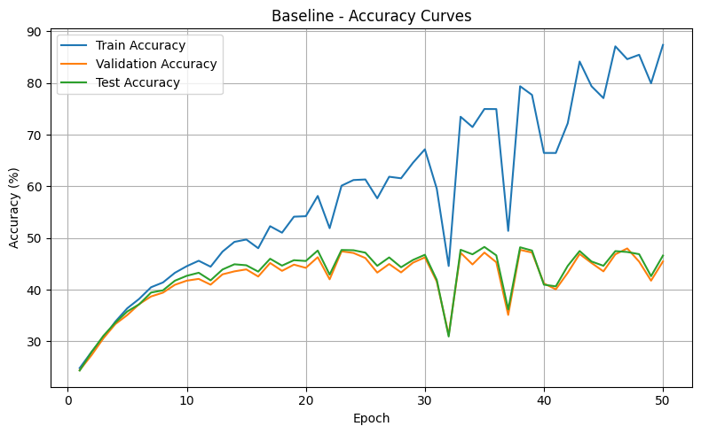
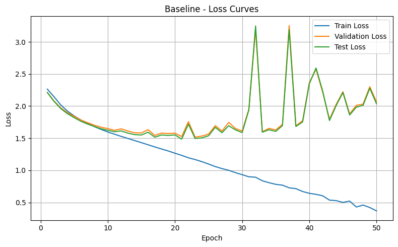
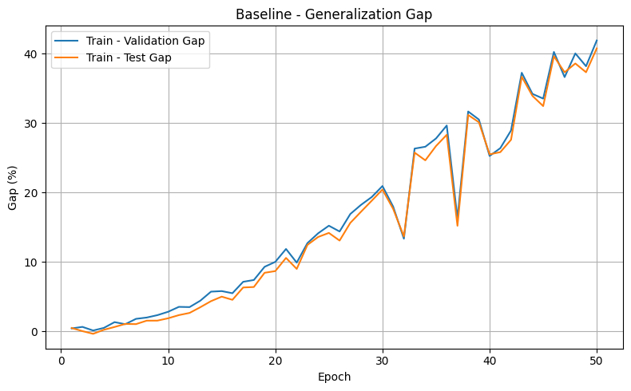

These figures visualize the behavior of the unregularized baseline and make the overfitting pattern directly observable. In particular, they help show why the baseline was used as the reference point for all later comparisons.

#### Dropout

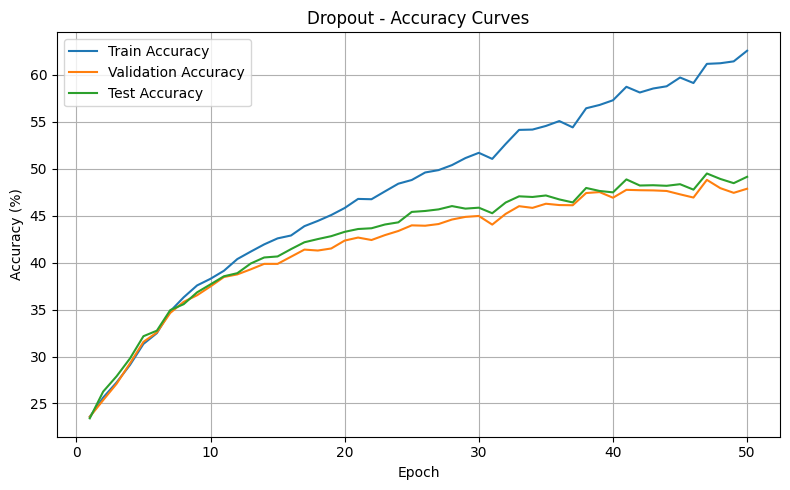
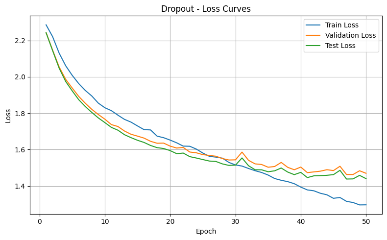
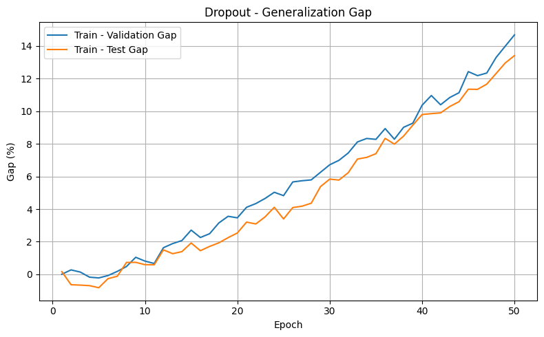

These plots are useful because they show how dropout changes the relationship between training and validation behavior relative to the baseline, especially in terms of reduced overfitting pressure.

#### Early Stopping

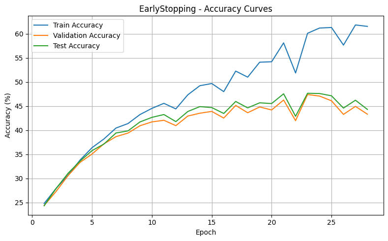
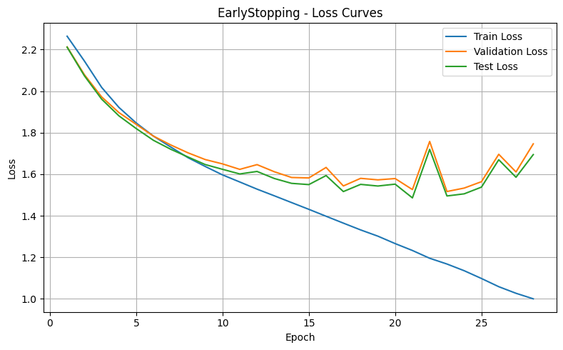
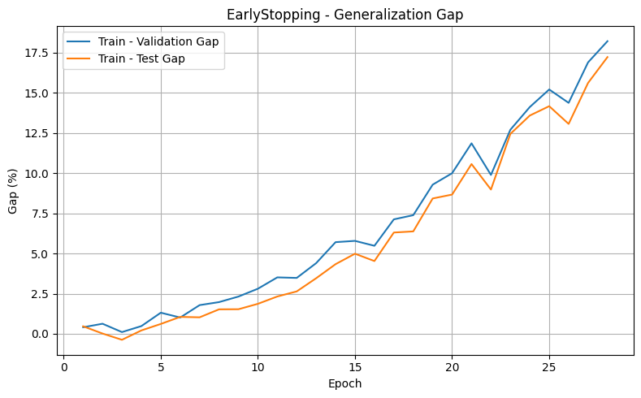

These figures illustrate how regularization through training-duration control differs from stochastic or penalty-based methods.

#### Batch Normalization

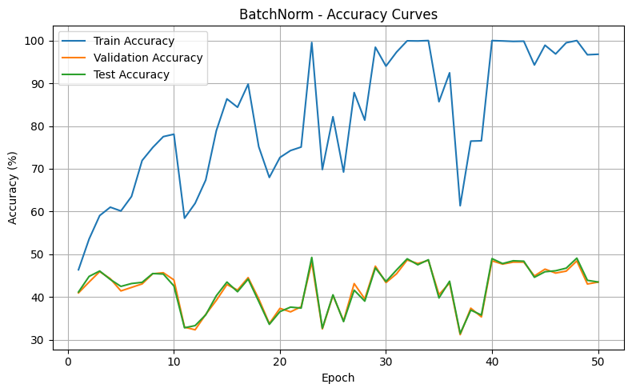
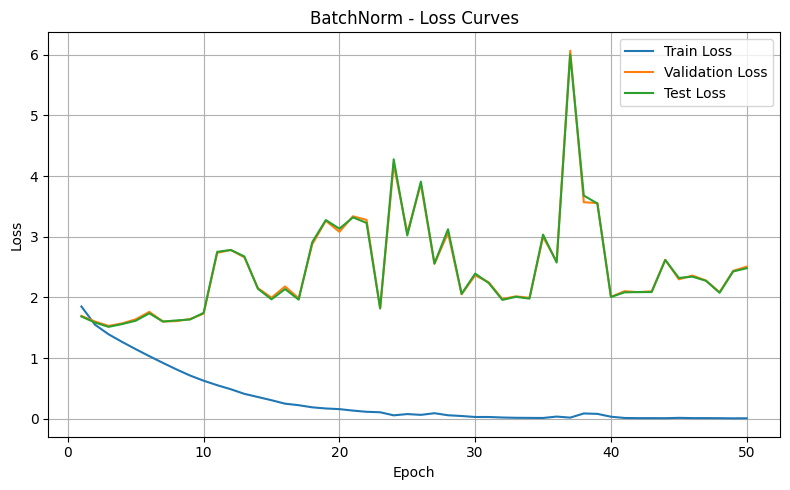
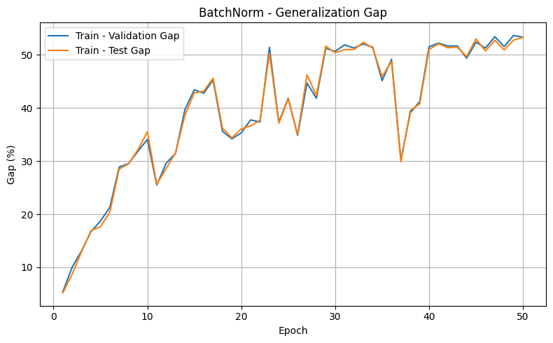

These plots are particularly important because batch normalization behaved differently from the other core regularization methods and therefore required separate interpretation.

#### Dropout + BatchNorm

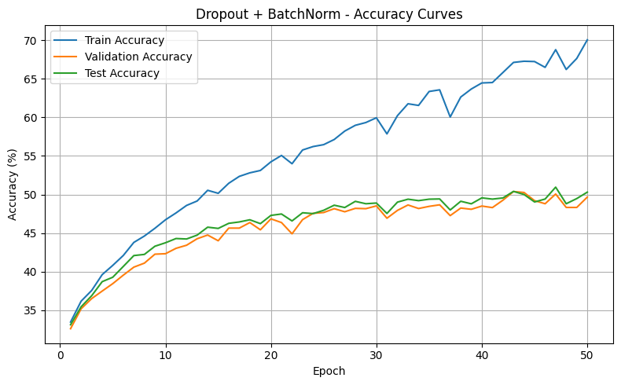
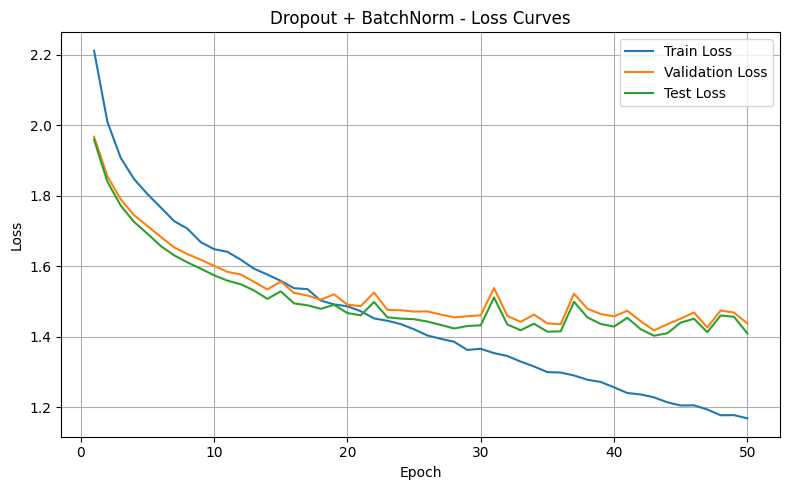
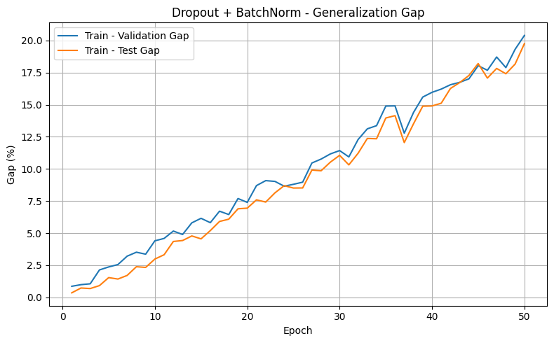

These figures help support the claim that combining complementary regularization mechanisms can be more effective than using either one in isolation.

#### L2 (MAP Gaussian Prior) + Dropout

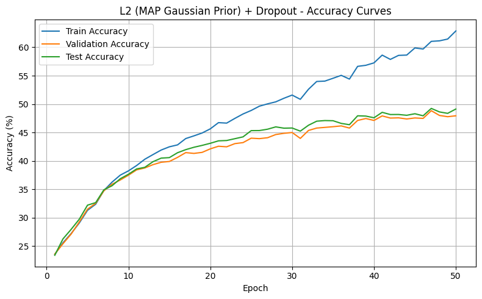
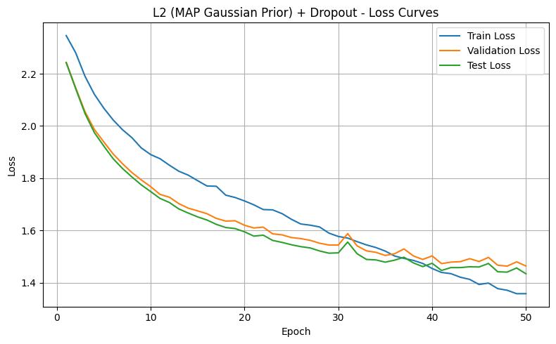
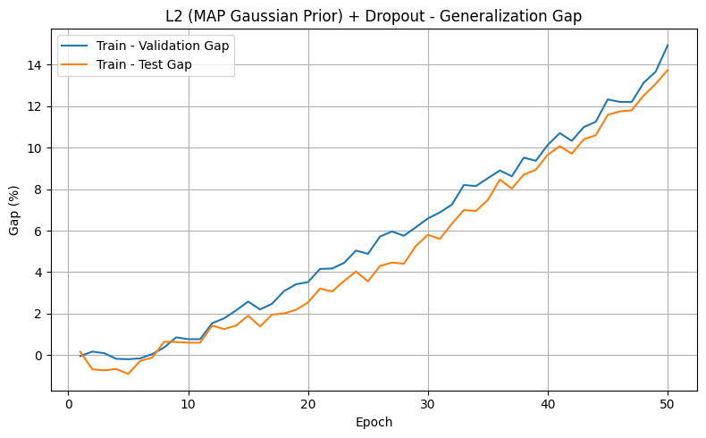
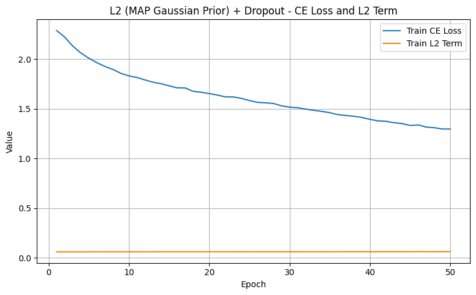

These figures are useful because they connect the empirical behavior of the model to the theoretical interpretation of L2 regularization as MAP estimation under a Gaussian prior.

### B. Summary Table

The repository includes a compact summary table under:

- `results/tables/experiment_summary.csv`

This table can be used as the main appendix-level summary for the controlled regularization branch, since it gathers the final train, validation, and test results of the core experiments in one place.

### C. Repository / Notebook Map

The experimental workflow of the repository can be read in the following order:

1. `reg_opt_00_baseline.ipynb`
2. `reg_00_modular_baseline.ipynb`
3. `reg_01_dropout.ipynb`
4. `reg_02_early_stopping.ipynb`
5. `reg_03_batchnorm.ipynb`
6. `reg_04_dropout_batchnorm.ipynb`
7. `reg_05_l2_map_gaussian_prior_dropout.ipynb`
8. `reg_06_comparison.ipynb`
9. `reg_08_l1_l2_v2.ipynb`
10. `reg_09_data_augmentation.ipynb`
11. `reg_10_adversarial_training.ipynb`
12. `reg_11_full_combo_before_optimization.ipynb`
13. `opt_01_optimization_final.ipynb`

This order follows the methodological progression of the project:

**baseline → isolated regularizers → extended regularizers → full combo → optimization tuning**

### D. Mathematical Note on MAP Interpretation of L2

In the regularization branch, L2 regularization is interpreted not only as weight decay, but also as a MAP estimation problem under a Gaussian prior. The objective is written as:

$$
\mathcal{L}_{\text{MAP}} = \mathcal{L}_{\text{CE}} + \lambda \sum_i w_i^2
$$

Under this interpretation:

- the cross-entropy term corresponds to the negative log-likelihood,
- the L2 term corresponds to the negative log-prior,
- and the full objective corresponds to Maximum A Posteriori estimation.

This note is included because it strengthens the theoretical grounding of the regularization analysis and directly connects implementation to probabilistic interpretation.
